# STM32 development environment with Visual Studio Code and CMake

This tutorial explains steps to effectively develop and debug STM32 application in *Visual Studio Code* using *CMake* build generator, *Ninja* build tool and *GCC* compiler.

Things you will learn

- How to install and setup all tools
- How to create new STM32 project with STM32CubeMX or STM32CubeIDE tools
- How to install and setup recommended extensions for *Visual Studio Code* for easier development
- How to setup CMake lists and CMake presets
- How to generate build system for compiler
- How to compile the project with GCC
- How to flash and debug application to the STM32 target

> This tutorial is using *Windows* operating system. Similar procedure will apply for Linux and MAC operating system.

# Tools installation

## STM32CubeIDE

First step is to install [STM32CubeIDE](https://www.st.com/en/development-tools/stm32cubeide.html), that will be used to easily start new *STM32* project and it comes with integrated *STM32CubeMX* tool - allowing us graphical configuration.

STM32CubeIDE also provides necessary tools needed later for *VSCode* development

- ARM none eabi GCC compiler
- ST-LINK GDBServer for debugging
- STM32CubeProgrammer tool for code downloading and respective ST-Link drivers
- Folder with STM32 SVD files
- Drivers for ST-Link

**Environmental path setup**

`3` paths should be added to environmental settings from STM32CubeIDE installation, one path for each of above-mentioned tools.
In case of my computer, using STM32CubeIDE 1.8 (updated through eclipse, hence my actual installation path is still showing version `1.0.2`) paths are defined as:

- GCC compiler: `c:\ST\STM32CubeIDE_1.0.2\STM32CubeIDE\plugins\com.st.stm32cube.ide.mcu.externaltools.gnu-tools-for-stm32.9-2020-q2-update.win32_2.0.0.202105311346\tools\bin\`
- ST-Link GDB server: `c:\ST\STM32CubeIDE_1.0.2\STM32CubeIDE\plugins\com.st.stm32cube.ide.mcu.externaltools.stlink-gdb-server.win32_2.0.100.202109301221\tools\bin\`
- STM32Cube Programmer CLI: `c:\ST\STM32CubeIDE_1.0.2\STM32CubeIDE\plugins\com.st.stm32cube.ide.mcu.externaltools.cubeprogrammer.win32_2.0.100.202110141430\tools\bin\`

> Your paths may differ at version numbers

Verify correct path setup, run:
```
arm-none-eabi-gcc --version
STM32_Programmer_CLI --version
ST-LINK_gdbserver --version
```

That should produce output similar to the picture below


## CMake

Download and install [CMake](https://cmake.org/).

Installation wizard will ask you to add CMake to environmental paths. Select the option or add `bin` folder of CMake installation folder to environmental path.

## Ninja

Download [Ninja build system](https://github.com/ninja-build/ninja/releases) from Github releases page.
It comes as portable executable, without need to install anything.
However it must be visible at environment level, like all previous tools.

Verify *CMake* and *Ninja* installation, run:
```
cmake --version
ninja --version
```

Output shall be something similar to


## Visual Studio Code

Download and install [VSCode](https://code.visualstudio.com/). Once installed and opened, window will look similar to the one below.


## Visual Studio Code extensions

*Visual Studio Code* is lightweight text editor with capability to enlarge it using extensions.

List of useful extensions for STM32 development using CMake:

- `ms-vscode.cpptools`: Syntax highlighting and other core features for C/C++ development
- `ms-vscode.cmake-tools`: CMake core tools, build system generator tool
- `twxs.cmake`: CMake color highlighting
- `marus25.cortex-debug`: Cortex-M debugging extension, mandatory for STM32 debug from VSCode
- `dan-c-underwood.arm`: ARM Assembly syntax highlighter
- `zixuanwang.linkerscript`: GCC Linker script syntax highlighter

You can install them by copying below commands in VSCode's internal terminal window.

```
code --install-extension ms-vscode.cpptools
code --install-extension ms-vscode.cmake-tools
code --install-extension twxs.cmake
code --install-extension marus25.cortex-debug
code --install-extension dan-c-underwood.arm
code --install-extension zixuanwang.linkerscript
```

> Go to *Terminal -> New Terminal* to open new terminal window

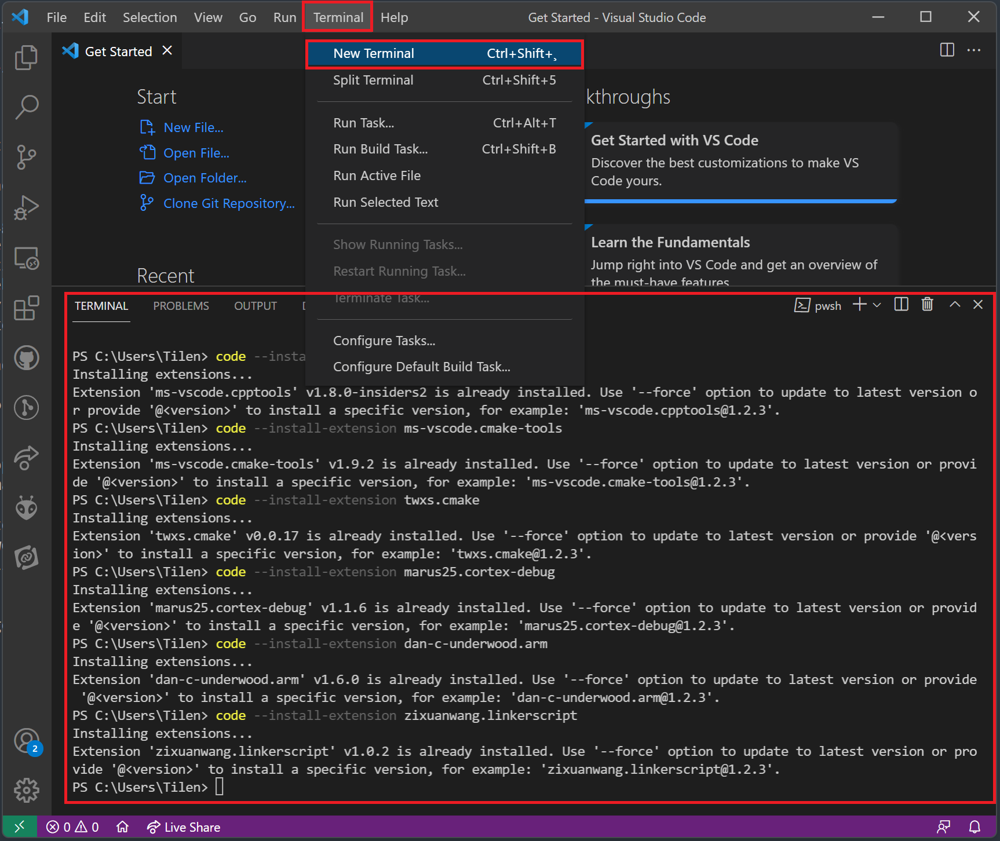

Alternative way is to use *Extension search GUI* and manually install from there.


## Tools installed - checkpoint

At this point, all the tools are properly installed - you are on the right track towards success.

# New project creation

Fundamental requirement to move forward is to have a working project that will be converted to *CMake* and developed in *VSCode*.
For this purpose, I will guide you through simple new project creation using *STM32CubeMX* or *STM32CubeIDE* software tools.

> I used *STM32CubeIDE* tool and  STM32H735G-DK board for this demo.

Open STM32CubeIDE and start new project


Select STM32 MCU - I selected *STM32H735IG* which is used on *STM32H735G-DK* board
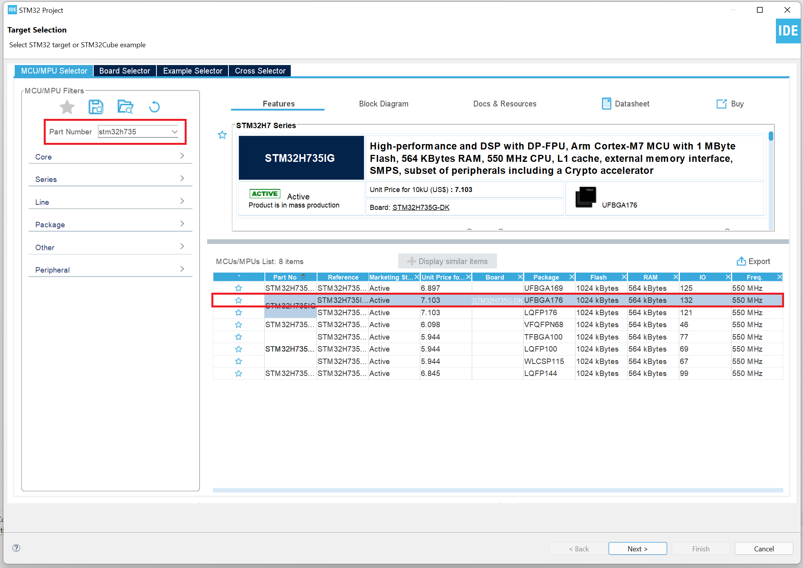

Select project name and path, then create project and wait for *Pinout view* to open


Our task is to have a simple project that will toggle leds. LEDs are connected to `PC2` and `PC3` respectively, active LOW. Pins can be configured in output push-pull or open-drain mode


Set pins as outputs with optional labels as `LED1` and `LED2` respectively


If you are using `STM32CubeMX`, go to *Project manager*, set project name and be sure `STM32CubeIDE` is selected as `Toolchain`.
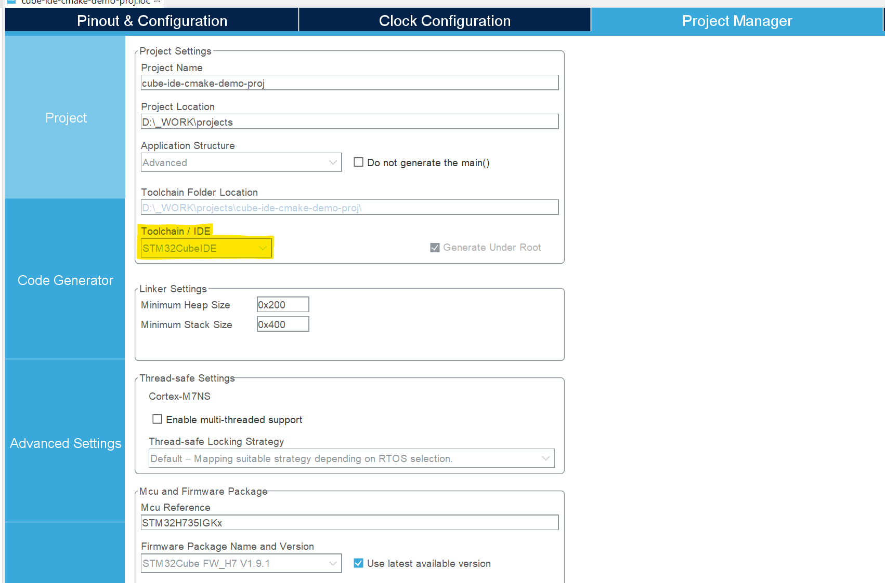

Go to advanced settings and select `LL` as drivers for generated code
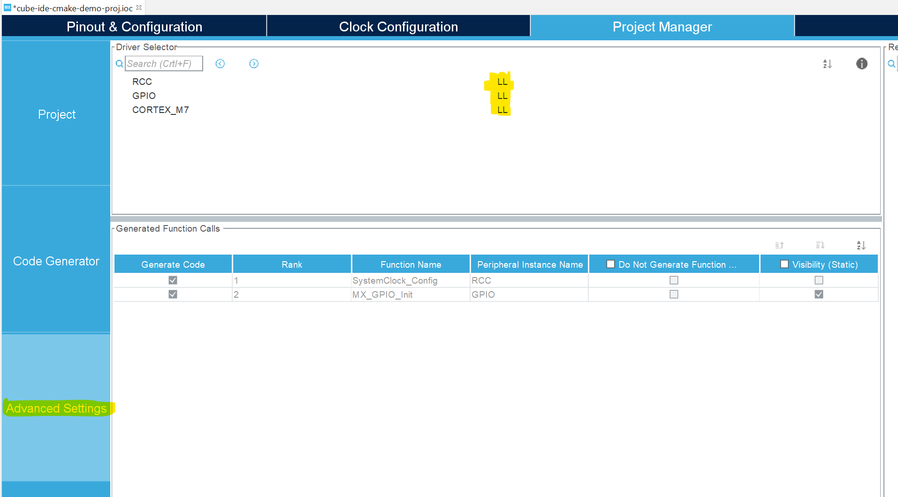
> We are using LL drivers for the sake of simplicity in this tutorial

Re-generate the project by pressing red button or by saving the project with `CTRL + S` shortcut


Project is now (re)generated. *Yellow* highlighted files are sources to build. *Blue* is linker script.
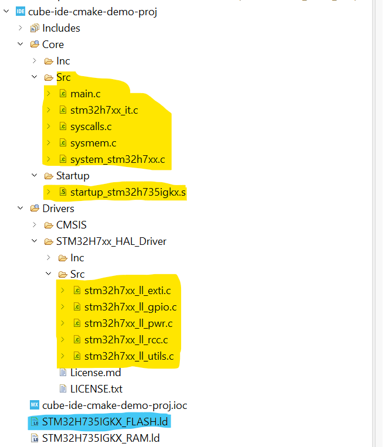

That's it for the first run, we are ready to compile. Hit `CTRL + B` or click on *hammer* icon to start.
*STM32CubeIDE* will compile the project, you should see similar as on picture below. It is now ready for flashing the MCU's flash and start debugging.
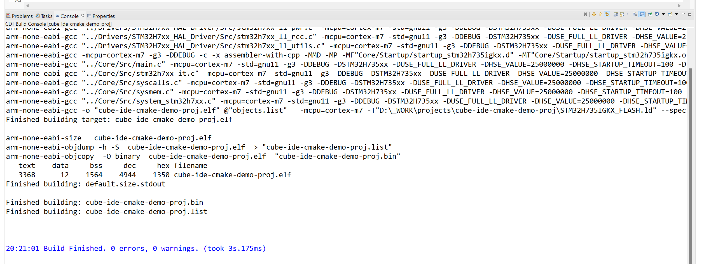

> This is end of first part, where we successfully created our project. At this point we consider project being ready to be transferred to CMake-based build system.

You can continue your development with STM32CubeIDE in the future, add new sources, modify code, compile, flash the binary and debug directly the microcontroller.
This is preferred STM32 development studio, developed and maintained by STMicroelectronics.

# CMake configuration

It is expected that project to develop in VSCode has been created. We will move forward for GCC compiler, but others could be used too.

With release of Visual Studio Code, many developers use the tool for many programming languages and fortunately can also develop STM32 applications with single tool.
If you are one of developers liking VSCode, most elegant way to move forward is to transfer STM32CubeIDE-based project to *CMake*, develop code in VSCode and compile with Ninja build system using GCC compiler. It is fast and lightweight.

> Development in VSCode is for intermediate or experienced users. I suggest to all STM32 beginners to stay with *STM32CubeIDE* development toolchain. It will be very easy to move forward and come to VSCode topic later.

## Prepare CMakeLists.txt file

Every CMake-based application requires `CMakeLists.txt` file *in the root directory*, that describes the project and provides input information for build system generation.

> Root `CMakeLists.txt` file is sometimes called *top-level CMake* file

Essential things described in `CMakeLists.txt` file:

- Toolchain information, such as GCC configuration with build flags
- Project name
- Source files to build with compiler, C, C++ or Assembly files
- List of include paths for compiler to find functions, defines, ... (`-I`)
- Linker script path
- Compilation defines, or sometimes called *preprocessor defines* (`-D`)
- Cortex-Mxx and floating point settings for instruction set generation

## Open VSCode in project root folder

Visual Studio Code has been installed and will be used as further file editor.

Find your generated project path and open folder with VSCode:

- Option 1: Go to the folder with explorer, then right click and select `Open in Code`.
- Option 2: Alternatively, open VScode as new empty solution and add folder to it manually. Use `File -> Open Folder...` to open folder
- Option 3: Go to folder with cmd or powershell tool and run `code .`

Final result should look similar to the one below


## Toolchain information

CMake needs to be aware about Toolchain we would like to use to finally compile the project with.
As same toolchain is usually reused among different projects, it is advised to create this part in separate file for easier reuse. These are generic compiler settings and not directly linked to projects itself.

A simple `.cmake` file can be used and later reused among your various projects. I am using name `cmake/gcc-arm-none-eabi.cmake` for this tutorial and below is its example:

```cmake
set(CMAKE_SYSTEM_NAME               Generic)
set(CMAKE_SYSTEM_PROCESSOR          arm)

# Some default GCC settings
# arm-none-eabi- must be part of path environment
set(TOOLCHAIN_PREFIX                arm-none-eabi-)
set(FLAGS                           "-fdata-sections -ffunction-sections --specs=nano.specs -Wl,--gc-sections")
set(CPP_FLAGS                       "-fno-rtti -fno-exceptions -fno-threadsafe-statics")

# Define compiler settings
set(CMAKE_C_COMPILER                ${TOOLCHAIN_PREFIX}gcc ${FLAGS})
set(CMAKE_ASM_COMPILER              ${CMAKE_C_COMPILER})
set(CMAKE_CXX_COMPILER              ${TOOLCHAIN_PREFIX}g++ ${FLAGS} ${CPP_FLAGS})
set(CMAKE_OBJCOPY                   ${TOOLCHAIN_PREFIX}objcopy)
set(CMAKE_SIZE                      ${TOOLCHAIN_PREFIX}size)

set(CMAKE_EXECUTABLE_SUFFIX_ASM     ".elf")
set(CMAKE_EXECUTABLE_SUFFIX_C       ".elf")
set(CMAKE_EXECUTABLE_SUFFIX_CXX     ".elf")

set(CMAKE_TRY_COMPILE_TARGET_TYPE STATIC_LIBRARY)
```

Create a file in the `cmake/` folder of root project directory.


> If CMake highlighter plugin is installed, VSCode will nicely highlight CMake commands for you

Toolchain setup is complete. You can freely close the file and move to next step.

## Create main CMakeLists.txt file

We need to create main `CMakeLists.txt`, also called *root* CMake file.

> Make sure you really name it `CMakeLists.txt` with correct upper and lowercase characters.

I prepared simple template file for you, that can be reused for all of your projects in the future. You will just need to change things like project name, source files, include paths, etc.

```cmake
cmake_minimum_required(VERSION 3.22)

# Setup compiler settings
set(CMAKE_C_STANDARD                11)
set(CMAKE_C_STANDARD_REQUIRED       ON)
set(CMAKE_C_EXTENSIONS              ON)
set(CMAKE_CXX_STANDARD              20)
set(CMAKE_CXX_STANDARD_REQUIRED     ON)
set(CMAKE_CXX_EXTENSIONS            ON)
set(PROJ_PATH                       ${CMAKE_CURRENT_SOURCE_DIR})
message("Build type: "              ${CMAKE_BUILD_TYPE})

#
# Core project settings
#
project(your-project-name)
enable_language(C CXX ASM)

#
# Core MCU flags, CPU, instruction set and FPU setup
# Needs to be set properly for your MCU
#
set(CPU_PARAMETERS
    -mthumb

    # This needs attention to properly set for used MCU
    -mcpu=cortex-m7
    -mfpu=fpv5-d16
    -mfloat-abi=hard
)

# Set linker script
set(linker_script_SRC               ${PROJ_PATH}/path-to-linker-script.ld)
set(EXECUTABLE                      ${CMAKE_PROJECT_NAME})

#
# List of source files to compile
#
set(sources_SRCS
    # Put here your source files, one in each line, relative to CMakeLists.txt file location
)

#
# Include directories
#
set(include_path_DIRS
    # Put here your include dirs, one in each line, relative to CMakeLists.txt file location
)

#
# Symbols definition
#
set(symbols_SYMB
    # Put here your symbols (preprocessor defines), one in each line
    # Encapsulate them with double quotes for safety purpose
)

# Executable files
add_executable(${EXECUTABLE} ${sources_SRCS})

# Include paths
target_include_directories(${EXECUTABLE} PRIVATE ${include_path_DIRS})

# Project symbols
target_compile_definitions(${EXECUTABLE} PRIVATE ${symbols_SYMB})

# Compiler options
target_compile_options(${EXECUTABLE} PRIVATE
    ${CPU_PARAMETERS}
    -Wall
    -Wextra
    -Wpedantic
    -Wno-unused-parameter
    # Full debug configuration
    -Og -g3 -ggdb
)

# Linker options
target_link_options(${EXECUTABLE} PRIVATE
    -T${linker_script_SRC}
    ${CPU_PARAMETERS}
    -Wl,-Map=${CMAKE_PROJECT_NAME}.map
    --specs=nosys.specs
    -u _printf_float                # STDIO float formatting support
    -Wl,--start-group
    -lc
    -lm
    -lstdc++
    -lsupc++
    -Wl,--end-group
    -Wl,--print-memory-usage
)

# Execute post-build to print size
add_custom_command(TARGET ${EXECUTABLE} POST_BUILD
    COMMAND ${CMAKE_SIZE} $<TARGET_FILE:${EXECUTABLE}>
)

# Convert output to hex and binary
add_custom_command(TARGET ${EXECUTABLE} POST_BUILD
    COMMAND ${CMAKE_OBJCOPY} -O ihex $<TARGET_FILE:${EXECUTABLE}> ${EXECUTABLE}.hex
)

# Convert to bin file -> add conditional check?
add_custom_command(TARGET ${EXECUTABLE} POST_BUILD
    COMMAND ${CMAKE_OBJCOPY} -O binary $<TARGET_FILE:${EXECUTABLE}> ${EXECUTABLE}.bin
)
```

Source files are the same as in *STM32CubeIDE* project. You can check previous image with highlighted sources in yellow color.

Symbols and include paths can be found in *STM32CubeIDE* under project settings. `2` pictures below are showing how it is in the case of demo project.

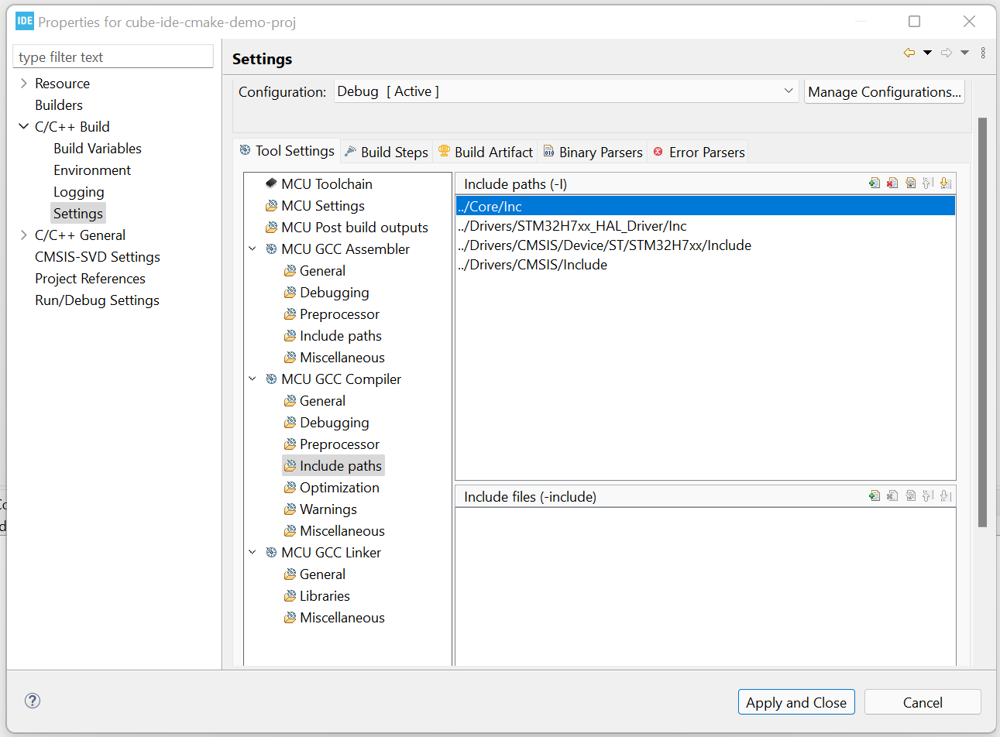


Cortex-Mxx setup needs a special attention, especially with floating point setup.
For `STM32H735xx`, settings should be set as below. 
```cmake
set(CPU_PARAMETERS
    -mthumb
    -mcpu=cortex-m7         # Set Cortex-M CPU
    -mfpu=fpv5-d16          # Set Floating point type
    -mfloat-abi=hard        # Hardware ABI mode
)
```


General rule for settings would be as per table below

|STM32 Family | -mcpu           | -mfpu         | -mfloat-abi |
|-------------|-----------------|---------------|-------------|
| STM32F0     | `cortex-m0`     | `Not used`    | `soft`      |
| STM32F1     | `cortex-m3`     | `Not used`    | `soft`      |
| STM32F2     | `cortex-m3`     | `Not used`    | `soft`      |
| STM32F3     | `cortex-m4`     | `fpv4-sp-d16` | `hard`      |
| STM32F4     | `cortex-m4`     | `fpv4-sp-d16` | `hard`      |
| STM32F7 SP  | `cortex-m7`     | `fpv5-sp-d16` | `hard`      |
| STM32F7 DP  | `cortex-m7`     | `fpv5-d16`    | `hard`      |
| STM32G0     | `cortex-m0plus` | `Not used`    | `soft`      |
| STM32C0     | `cortex-m0plus` | `Not used`    | `soft`      |
| STM32G4     | `cortex-m4`     | `fpv4-sp-d16` | `hard`      |
| STM32H7     | `cortex-m7`     | `fpv5-d16`    | `hard`      |
| STM32L0     | `cortex-m0plus` | `Not used`    | `soft`      |
| STM32L1     | `cortex-m3`     | `Not used`    | `soft`      |
| STM32L4     | `cortex-m4`     | `fpv4-sp-d16` | `hard`      |
| STM32L5     | `cortex-m33`    | `fpv5-sp-d16` | `hard`      |
| STM32U5     | `cortex-m33`    | `fpv5-sp-d16` | `hard`      |
| STM32WB     | `cortex-m4`     | `fpv4-sp-d16` | `hard`      |
| STM32WL CM4 | `cortex-m4`     | `Not used`    | `soft`      |
| STM32WL CM0 | `cortex-m0plus` | `Not used`    | `soft`      |

> This table is a subject of potential mistakes, not tested with *GCC compiler* for all lines. For STM32F7, go to [STM32F7xx official site](https://www.st.com/en/microcontrollers-microprocessors/stm32f7-series.html) and check if your device has single or double precision FPU, then apply settings accordingly.

Final `CMakeLists.txt` file after source files, include paths, MCU core settings and defines are set:
```cmake
cmake_minimum_required(VERSION 3.22)

# Setup compiler settings
set(CMAKE_C_STANDARD                11)
set(CMAKE_C_STANDARD_REQUIRED       ON)
set(CMAKE_C_EXTENSIONS              ON)
set(CMAKE_CXX_STANDARD              20)
set(CMAKE_CXX_STANDARD_REQUIRED     ON)
set(CMAKE_CXX_EXTENSIONS            ON)
set(PROJ_PATH                       ${CMAKE_CURRENT_SOURCE_DIR})
message("Build type: "              ${CMAKE_BUILD_TYPE})

#
# Core project settings
#
project(STM32H735G-DK-LED)          # Modified
enable_language(C CXX ASM)

#
# Core MCU flags, CPU, instruction set and FPU setup
# Needs to be set properly for your MCU
#
set(CPU_PARAMETERS
    -mthumb

    # This needs attention to properly set for used MCU
    -mcpu=cortex-m7                 # Modified
    -mfpu=fpv5-d16                  # Modified
    -mfloat-abi=hard                # Modified
)

# Set linker script
set(linker_script_SRC               ${PROJ_PATH}/STM32H735IGKX_FLASH.ld) # Modified
set(EXECUTABLE                      ${CMAKE_PROJECT_NAME})

#
# List of source files to compile
#
set(sources_SRCS                    # Modified
    ${PROJ_PATH}/Core/Src/main.c
    ${PROJ_PATH}/Core/Src/stm32h7xx_it.c
    ${PROJ_PATH}/Core/Src/syscalls.c
    ${PROJ_PATH}/Core/Src/sysmem.c
    ${PROJ_PATH}/Core/Src/system_stm32h7xx.c
    ${PROJ_PATH}/Core/Startup/startup_stm32h735igkx.s
    ${PROJ_PATH}/Drivers/STM32H7xx_HAL_Driver/Src/stm32h7xx_ll_exti.c
    ${PROJ_PATH}/Drivers/STM32H7xx_HAL_Driver/Src/stm32h7xx_ll_gpio.c
    ${PROJ_PATH}/Drivers/STM32H7xx_HAL_Driver/Src/stm32h7xx_ll_pwr.c
    ${PROJ_PATH}/Drivers/STM32H7xx_HAL_Driver/Src/stm32h7xx_ll_rcc.c
    ${PROJ_PATH}/Drivers/STM32H7xx_HAL_Driver/Src/stm32h7xx_ll_utils.c
)

#
# Include directories
#
set(include_path_DIRS               # Modified
    ${PROJ_PATH}/Core/Inc
    ${PROJ_PATH}/Drivers/STM32H7xx_HAL_Driver/Inc
    ${PROJ_PATH}/Drivers/CMSIS/Device/ST/STM32H7xx/Include
    ${PROJ_PATH}/Drivers/CMSIS/Include
)

#
# Symbols definition
#
set(symbols_SYMB                    # Modified
    "DEBUG"
    "STM32H735xx"
    "USE_FULL_LL_DRIVER"
    "HSE_VALUE=25000000"
)

# Executable files
add_executable(${EXECUTABLE} ${sources_SRCS})

# Include paths
target_include_directories(${EXECUTABLE} PRIVATE ${include_path_DIRS})

# Project symbols
target_compile_definitions(${EXECUTABLE} PRIVATE ${symbols_SYMB})

# Compiler options
target_compile_options(${EXECUTABLE} PRIVATE
    ${CPU_PARAMETERS}
    -Wall
    -Wextra
    -Wpedantic
    -Wno-unused-parameter
    # Full debug configuration
    -Og -g3 -ggdb
)

# Linker options
target_link_options(${EXECUTABLE} PRIVATE
    -T${linker_script_SRC}
    ${CPU_PARAMETERS}
    -Wl,-Map=${CMAKE_PROJECT_NAME}.map
    --specs=nosys.specs
    -u _printf_float                # STDIO float formatting support
    -Wl,--start-group
    -lc
    -lm
    -lstdc++
    -lsupc++
    -Wl,--end-group
    -Wl,--print-memory-usage
)

# Execute post-build to print size
add_custom_command(TARGET ${EXECUTABLE} POST_BUILD
    COMMAND ${CMAKE_SIZE} $<TARGET_FILE:${EXECUTABLE}>
)

# Convert output to hex and binary
add_custom_command(TARGET ${EXECUTABLE} POST_BUILD
    COMMAND ${CMAKE_OBJCOPY} -O ihex $<TARGET_FILE:${EXECUTABLE}> ${EXECUTABLE}.hex
)

# Convert to bin file -> add conditional check?
add_custom_command(TARGET ${EXECUTABLE} POST_BUILD
    COMMAND ${CMAKE_OBJCOPY} -O binary $<TARGET_FILE:${EXECUTABLE}> ${EXECUTABLE}.bin
)
```

In VSCode, well highlighted, it looks like this
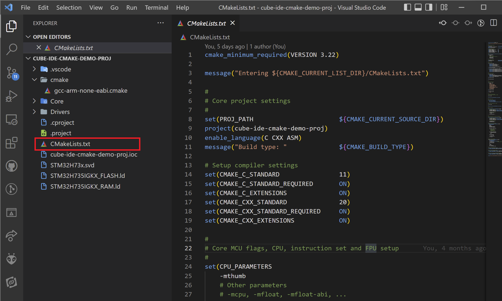

## Create preset CMakePresets.json file

`CMakePresets.json` is a special file, available since CMake `3.18` and provides definition for user configuration, similar to *debug* and *release* configuration known in eclipse. Having this file allows developer to quickly change between *debug* and *release* mode, or even between *bootloader* and *main application*, that is a common use case in embedded applications.

> This tutorial will not focus on details about the file, rather here is the provided template file

File describes:
- Path to build directory for each build configuration
- Default build type for each configuration (*Debug*, *Release*, ...)
- Path to *.cmake* toolchain descriptor

> `4` presets are configured in the template for each of the default *CMake* configurations

```json
{
    "version": 3,
    "configurePresets": [
        {
            "name": "default",
            "hidden": true,
            "generator": "Ninja",
            "binaryDir": "${sourceDir}/build/${presetName}",
            "toolchainFile": "${sourceDir}/cmake/gcc-arm-none-eabi.cmake",
            "cacheVariables": {
                "CMAKE_EXPORT_COMPILE_COMMANDS": "ON"
            }
        },
        {
            "name": "Debug",
            "inherits": "default",
            "cacheVariables": {
                "CMAKE_BUILD_TYPE": "Debug"
            }
        },
        {
            "name": "RelWithDebInfo",
            "inherits": "default",
            "cacheVariables": {
                "CMAKE_BUILD_TYPE": "RelWithDebInfo"
            }
        },
        {
            "name": "Release",
            "inherits": "default",
            "cacheVariables": {
                "CMAKE_BUILD_TYPE": "Release"
            }
        },
        {
            "name": "MinSizeRel",
            "inherits": "default",
            "cacheVariables": {
                "CMAKE_BUILD_TYPE": "MinSizeRel"
            }
        }
    ]
}
```
> Always up-to-date file is available in `templates/CMakePresets.json`

## Run CMake commands

We have configured *CMake* with project information and are now ready to run the CMake commands.

VSCode comes with *CMake Tools* plugin - a great helper for CMake commands. When installed, several options are available at the bottom of the VSCode active window

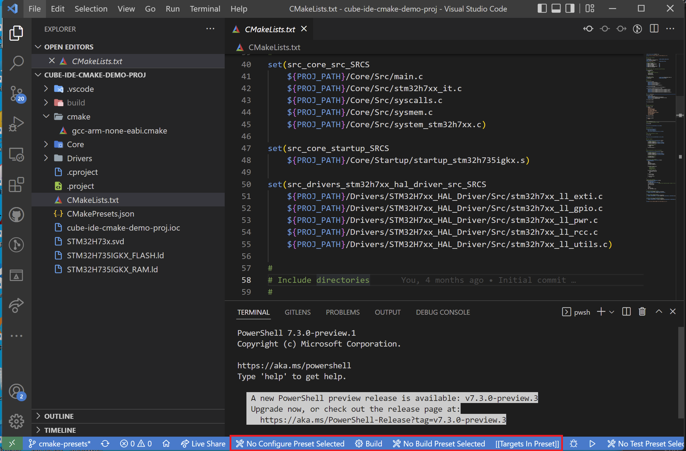

As you can see, there is no Configuration Preset selected.

> If you do not see such information, hit `CTRl + ALT + P` and run `CMake: Quick Start` command.

Next step is to select current *preset*. Click on *No Configure Preset Selected* to open a window on top side and select your *preset*. I selected *debug* for the sake of this tutorial.

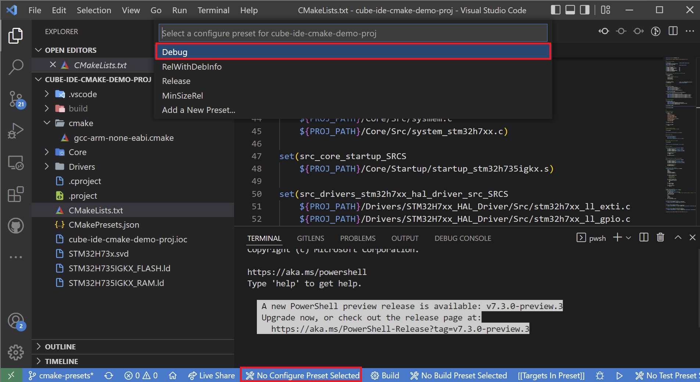

When selected, text will change to selected *preset label*.


Now that preset is active, every time user will modify `CMakeLists.txt` file, thanks to *CMake-Tools* extension, VSCode will automatically invoke build generation command to apply new changes.

# Build project

Our project is ready for building and linking. Unless CMake build generation step failed, we should have build directory ready to invoke *ninja build system*.

Next step is to hit *Build* button - as indicated with green rectangle. CMake will run commands:

- Run build generator for selected preset
- Actually build code with *Ninja*


> If it builds well, final step on the output is print of memory use with different sections.

As a result, we got some output in `build/<presetname>/` directory:

- `project-name.elf` file with complete executable information
- `project-name.hex` HEX file
- `project-name.bin` BIN file
- `project-name.map` map file

In default configuration, `.hex` and `.bin` files are not generated nor *memory usage* is displayed.
Our prepared `CMakeLists.txt` file includes `POST_BUILD` options, to execute additional commands after successful build.
Code is already in your `CMakeLists.txt` file, so no need to do anything, just observe.

It executes command to:
- Print used size of each region + final executable memory consumption
- Generate `.hex` file from executable
- Generate `.bin` file from executable

```cmake
# Execute post-build to print size
add_custom_command(TARGET ${EXECUTABLE} POST_BUILD
    COMMAND ${CMAKE_SIZE} $<TARGET_FILE:${EXECUTABLE}>
)

# Convert output to hex and binary
add_custom_command(TARGET ${EXECUTABLE} POST_BUILD
    COMMAND ${CMAKE_OBJCOPY} -O ihex $<TARGET_FILE:${EXECUTABLE}> ${EXECUTABLE}.hex
)

# Convert to bin file -> add conditional check?
add_custom_command(TARGET ${EXECUTABLE} POST_BUILD
    COMMAND ${CMAKE_OBJCOPY} -O binary $<TARGET_FILE:${EXECUTABLE}> ${EXECUTABLE}.bin
)
```

> To disable `.bin` file generation, simply delete `POST_BUILD` line for `.bin` and regenerate CMake build system commands.
> Generating `.bin` files may have a negative effect when memory is split between internal and external flash memories. It may generate very large files (`>= 2GB`) with plenty of non-used zeros. 

There is a list of useful commands to keep in mind during project development:

- Build changes
- Clean project
- Re-build project, with clean first
- Flash project

Its easy to forget full syntax, rather let's create `.vscode/tasks.json` file with commands list, for quick run:
```json
{
	"version": "2.0.0",
	"tasks": [
        {
            "type": "cppbuild",
            "label": "Build project",
            "command": "cmake",
            "args": ["--build", "${command:cmake.buildDirectory}", "-j", "8"],
            "options": {
                "cwd": "${workspaceFolder}"
            },
            "problemMatcher": ["$gcc"],
            "group": {
                "kind": "build",
                "isDefault": true
            }
        },
        {
            "type": "shell",
            "label": "Re-build project",
            "command": "cmake",
            "args": ["--build", "${command:cmake.buildDirectory}", "--clean-first", "-v", "-j", "8"],
            "options": {
                "cwd": "${workspaceFolder}"
            },
            "problemMatcher": ["$gcc"],
        },
        {
            "type": "shell",
            "label": "Clean project",
            "command": "cmake",
            "args": ["--build", "${command:cmake.buildDirectory}", "--target", "clean"],
            "options": {
                "cwd": "${workspaceFolder}"
            },
            "problemMatcher": []
        },
        {
            "type": "shell",
            "label": "CubeProg: Flash project (SWD)",
            "command": "STM32_Programmer_CLI",
            "args": [
                "--connect",
                "port=swd",
                "--download", "${command:cmake.launchTargetPath}",
                "-hardRst"
            ],
            "options": {
                "cwd": "${workspaceFolder}"
            },
            "problemMatcher": []
        },
        {
            "type": "shell",
            "label": "CubeProg: Flash project with defined serial number (SWD) - you must set serial number first",
            "command": "STM32_Programmer_CLI",
            "args": [
                "--connect",
                "port=swd",
                "sn=<yourserialnumber>",
                "--download", "${command:cmake.launchTargetPath}",
                "-hardRst"
            ],
            "options": {
                "cwd": "${workspaceFolder}"
            },
            "problemMatcher": []
        },
        {
            "type": "shell",
            "label": "CubeProg: List all available communication interfaces",
            "command": "STM32_Programmer_CLI",
            "args": [
                "--list",
            ],
            "options": {
                "cwd": "${workspaceFolder}"
            },
            "problemMatcher": []
        },
    ]
}
```
> Always up-to-date file is available in `templates/.vscode/tasks.json`

Tasks defined in `tasks.json` can be invoked in VSCode interface using `Terminal -> Run Task` or with `CTRL + ALT + T` shortcut
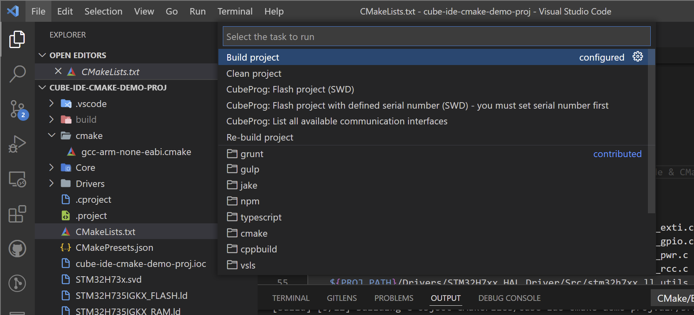

*Build Project* task is configured as *default*, which will get executed when we run default task, or press shortcut `CTRL + SHIFT + B`.

```json
"group": {
    "kind": "build",
    "isDefault": true
}
```

## List project files with CMake-Tools plugin

*CMake-Tools* VSCode plugin comes with very nice feature, that being listing all files in the project.
When project uses files outside *root folder* tree, there is no way to see them in VSCode by default, unless you add another folder to project workspace, but then you *destroy* some of the features listed above.

*CMake-Tools* extension well parses `CMakeLists.txt` file and is able to display all the source files, currently part of the CMake build system generation and later part of GCC build thanks to *Ninja*.
On the left side of the screen, you will find an icon for *CMake* build, marked red on picture below.


It draws virtual folder tree according to source (executable) files path listed in `CMakeLists.txt` file.

For the sake of this demonstration purpose, I created a file `demo_file.c`, one folder up from `CMakeLists.txt` location and added it to the project.
After CMake build system generation, we can see virtual file added in *CMake-Tools browser*.


Thanks to this feature, we can have a full control over files being part of build and can quickly find files to modify, even if these are outside workspace folder directory.

## GCC Problem matcher

Another nice *Build Project* task parameter is `"problemMatcher": ["$gcc"],` set to GCC, which means that terminal output is parsed against GCC standard format and in case of warnings or errors, it will display nice messages in *Problems* view.


We reached at the end of CMake configuration and build setup.
You can freely modify C source code and and/remove files from/to project.
This is now fully working GCC-based compilation system running in VSCode.

> Do not forget to regenerate CMake when `CMakeLists.txt` file gets modified, or use *Build* button to do it for you.

## Stop receiving virtual C/C++ errors

As you may have noticed, some lines in C files are red-underlined, reporting a `could not find resource` error, but when compiled, all is working just fine.


This is reported by `CppTools` extension as it cannot find resources by default, as Intellisense is not aware of include paths or preprocessor defines.

> It will still compile well as include paths are defined in `CMakeLists.txt`, just VSCode Intellisense editor won't work by default.

To overcome this problem, let's create `.vscode/c_cpp_properties.json` file and copy below text to it
```json
{
    "version": 4,
    "configurations": [
        {
            /* 
             * ms-vscode.cmake-tools plugin should be installed.
             * 
             * It provides data for C/C++ plugin,
             * such as include paths, browse paths, defines, etc.
             */
            "name": "STM32",
            "configurationProvider": "ms-vscode.cmake-tools",
            "intelliSenseMode": "${default}"
        }
    ]
}
```
> Always up-to-date file is available in `templates/.vscode/c_cpp_properties.json`


We provided settings for `C/C++` extension, mainly for Intellisense feature, and configure it in a way to use `CMake-Tools` extension to find include paths and list of defines (preprocessor defined).

No errors are visible anymore and Intellisense is now fully operational.
You can test it by going to one resource (ex. with mouse over a function name), then click `CTRL + left mouse click` command and you should jump to definition location directly.
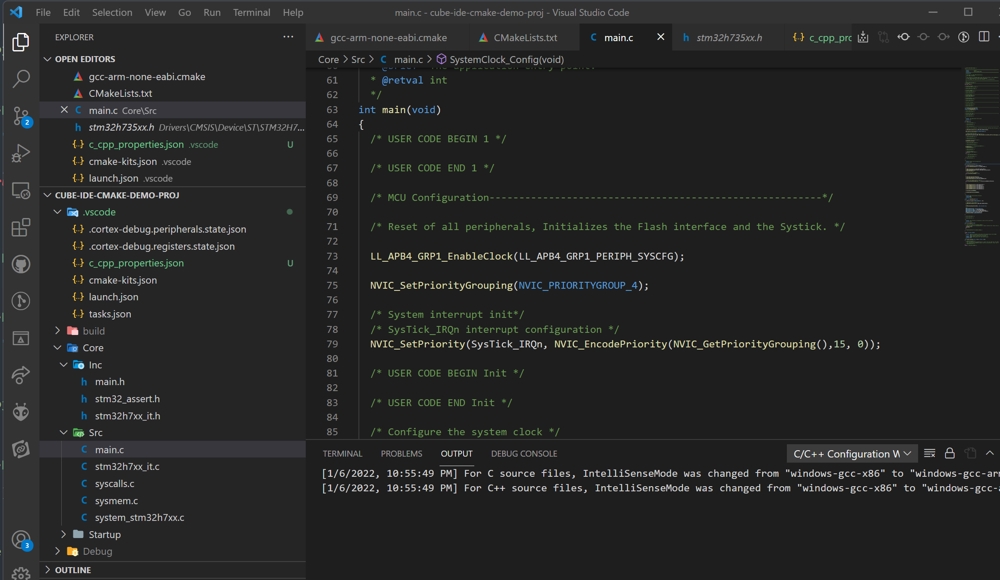

> `.vscode/c_cpp_properties.json` is used for `CppTools` extension purpose.

# Debug project with cortex-debug

Our `.elf` file has been built in previous section and can't wait to be uploaded into MCU flash and executed by *Cortex-M core*.
We will use `Cortex-Debug` extension for debugging purpose, that will also flash firmware for us.

First thing is to create `.vscode/launch.json` file and copy below content to it:

```json
{
    "version": "0.2.0",
    "configurations": [
        {
            "name": "Debug Microcontroller - STLink-V3",
            "cwd": "${workspaceFolder}",        //Path from where commands are executed
            "type": "cortex-debug",             //Debug 
            "executable": "${command:cmake.launchTargetPath}", //or fixed file path: build/project-name.elf
            "request": "launch",                //Use "attach" to connect to target w/o elf download
            "servertype": "stlink",             //Use stlink setup of cortex-M debug
            "device": "STM32H735IG",            //MCU used
            "interface": "swd",                 //Interface setup
            "serialNumber": "",                 //Set ST-Link ID if you use multiple at the same time
            "runToEntryPoint": "main",          //Run to main and stop there
            "svdFile": "STM32H73x.svd",         //SVD file to see reisters
            "v1": false,
            "showDevDebugOutput": "both",

            /* Will get automatically detected if STM32CubeIDE is installed to default directory
               or it can be manually provided if necessary.. */
            //"serverpath": "c:\\ST\\STM32CubeIDE_1.7.0\\STM32CubeIDE\\plugins\\com.st.stm32cube.ide.mcu.externaltools.stlink-gdb-server.win32_2.0.100.202109301221\\tools\\bin\\ST-LINK_gdbserver.exe",
            //"armToolchainPath": "c:\\ST\\STM32CubeIDE_1.7.0\\STM32CubeIDE\\plugins\\com.st.stm32cube.ide.mcu.externaltools.gnu-tools-for-stm32.9-2020-q2-update.win32_2.0.0.202105311346\\tools\\bin",
            //"stm32cubeprogrammer": "c:\\Program Files\\STMicroelectronics\\STM32Cube\\STM32CubeProgrammer\\bin",

            /* If you use external loader, add additional arguments */
            //"serverArgs": ["--extload", "path/to/ext/loader.stldr"],
        }
    ]
}
```
> Always up-to-date launch file is available in `templates/.vscode/launch.json`

And you are ready to go! Hit `F5` and you should enter debug session with your MCU.


> Be sure to have ST-Link debug probe software at its latest version.

Extension will invoke ST-GDBServer application, and will take `.elf` file as defined by *CMake* as target launch file.

## Debug to main


You have full control over stepping and can set breakpoints like you would in STM32CubeIDE.

## MCU registers with SVD

If you have MCU SVD file, add its path in `launch.json` configuration, and you will see all peripheral registers in MCU.


## Memory view

To view memory, open command palette with `CTRL + SHIFT + P` and type `memory`

First select command to view memory

Select memory start address

And memory length to fetch

Nice view of MCU memory


## Assembly stepping

You can step with assembly instructions

Open Command Palette and type `Cortex` and pick disassembly, then type function to disassemble.
It is possible to later step by step assembly instructions too.

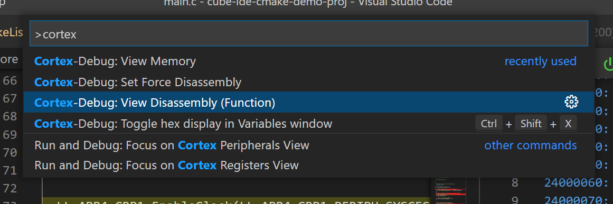

Many other features are available.

# Conclusion

This is all for the tutorial.
We showed how to create first project with STM32CubeIDE or STM32CubeMX to have its structure, sources and graphical configuration, later transferred to VSCode, CMake and Cortex-debug.

Full project from this tutorial is available in `cube-ide-cmake-demo-proj` folder

# Automatic STM32CubeIDE script

Part of this repository is also `converter.py` experimetal script, target being taking location of your STM32CubeIDE generated project as an input, finding `.cproject` and `.project` files and generate appropriate `CMakeLists.txt` file, to allow users to use VSCode environment, fully automatically.

> It is very experimental use case, however it works well for basic projects generated with STM32CubeIDE. It has not been tested extensively for the moment and bugs may still appear.

## Features

- Uses base project folder as input path parameter
- Tries to find and parse .cproject and .project files
- Parses linked files of .c, .cpp or .s types
- Parses "Source directories" and scans for files inside. This is typical STM32CubeMX configuration where no "linked-files" are used, but "source folders" instead
- Supports "build" configuration mode only, release configuration is considered advanced feature
- Supports C, CXX and ASM compilers and linker
- Generates include paths for each compiler type (C, CXX, ASM)
- Generates symbols list for each compiler type (C, CXX, ASM)
- Determines Cortex-Mxx from STM32xx name
- Adjusts FPU and float-ABI settings
- Finds linker script
- Supports static library linkage
- Tested with
  - Simple project generated with STM32CubeMX for STM32H735 and STM32G474
  - More complex project generated with TouchGFX-Designer
    - All types of files
    - C++, C, ASM, static library
    - Linked files
    - Source folders
    . ...
- Experimental purpose only

## Tools needed:

- VSCode with aforementioned extensions
- CMake tool installed and in environment path
- Ninja build system installed and in environment path
- ARM none eabi compiler in environment path (comes with STM32CubeIDE)
- STM32CubeIDE or STM32CubeMX to generate project
- Python 3

> Following aforementioned tutorial will make sure all the tools are installed, except python.

## How to use it

Run script with arguments:
```
python converter.py --path "path1" ["path2" ["pathn", [...]]]
```

As an example, giving demo projects in `script-projects/` dir, script shall be executed as
```
python converter.py --path "script-projects/h735g-dk-touchgfx/" "script-projects/h735g-dk-usart/"
```
`CMakeLists.txt` will be generated in the provided paths, but only if converter is able to find `.project` and `.cproject` files inside project directory

## Known limitations

- No support for dual-core devices
- No support for Cortex-M33 with TrustZone configuration
- Simple parsing of "linker script" field is too simple -> needs stronger processing
- Sometimes *.c and *.cpp from build are included

## Contribution

Do not hesitate to propose changes you believe will improve this script.
It should be a community project, work in synergy with worldwide ideas.
